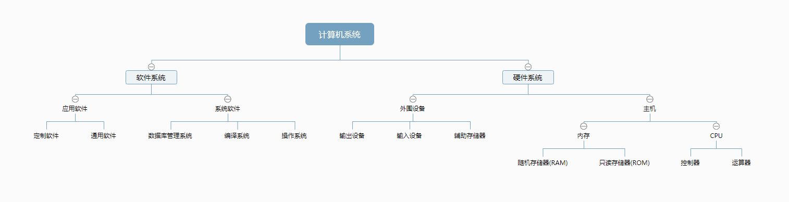
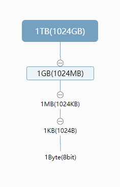

title: 恩施市中等职业技术学校
speaker: uanliy
url: https://github.com/YL9/Teaching-materials
js:
    - https://www.echartsjs.com/asset/theme/infographic.js
plugins:
    - echarts: {theme: infographic}
    - mermaid: {theme: forest}
    - katex

<slide class="bg-black-blue aligncenter" image="https://cn.bing.com/az/hprichbg/rb/RainierDawn_EN-AU3730494945_1920x1080.jpg .dark">

# 计算机应用基础 {.text-landing.text-shadow}

中等职业技术学校学生必修的一门公共基础课程 {.text-intro.animated.fadeInUp.delay-500}

[:fa-github: Github](https://github.com/YL9/Teaching-materials){.button.ghost.animated.flipInX.delay-1200}

<slide :class="size-30 aligncenter">

### 第二章

#### 认识计算机

---

`一个完整的计算机系统组成` {.animated.fadeInUp}

<slide class="bg-blue aligncenter" video="https://webslides.tv/static/videos/working.mp4 poster='https://webslides.tv/static/images/working.jpg' .dark">



`硬件系统` or `软件系统`

<slide :class="size-80">

:::card

## 计算机的硬件系统

[硬件系统](https://baike.baidu.com/item/%E7%A1%AC%E4%BB%B6%E7%B3%BB%E7%BB%9F/1513031?fr=aladdin) 从功能上可以划分为五大基础组成部分，即**运算器**、**控制器**、**存储器**、**输入设备**和**输出设备**。主机系统由**运算器**、**控制器**和**存储器**组成。 {.text-intro}

-   :运算器\::{.text-label} 进行算术运算和逻辑运算
-   :控制器\::{.text-label} 协调计算机各部件工作&nbsp;&nbsp;&nbsp;&nbsp;*CPU由控制器和运算器组成*
-   :存储器\::{.text-label} 计算机数据存储
    {.description}

---


:::

<slide class="bg-black" video="https://webslides.tv/static/videos/working.mp4 poster='https://webslides.tv/static/images/working.jpg'" >

## 计算机的软件系统

> 在硬件设备上运行的各种程序、数据以及有关的资料，包括**系统软件**和**应用软件**。

<slide :class="size-40 aligncenter">

### 计算机的主要性能指标

---

```shell {.animated.fadeInUp}
 # 字长
$ 在计算机中作为一个整体被CPU存取、传送、处理的一组二进制数字串叫做一个字，每个字中的
二进制位，称为字长。

# 主频
$ 主频即CPU的时钟频率，计算机的操作在时钟信号的控制下分步执行，每个时钟信号周期完成一
步操作，时钟频率的高低在很大程度上反映了CPU速度的快慢。

# 存储容量
$ 存储容量是指计算机能够存储数据的总字节数。

# 存取周期
$ 存储器进行一次"读"或"写"操作所需的时间，称为存储器的访问时间，连续启动两次独立的"读"
或"写"操作所需的最短时间，称为存取周期。

# 运算速度
$ 指CPU每秒处理指令的多少，单位是MIPS，即百万条指令每秒。
```

<slide :class="size-30 aligncenter">



---

`Byte(字节)` or `bit(比特&位)` {.animated.fadeInUp}

<slide class="bg-purple" :class="size-50 aligncenter" image="http://h1.ioliu.cn/bing/SandiaSunrise_ZH-CN11155504388_1920x1080.jpg .dark">

# Thanks
