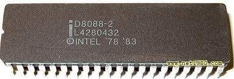

title: 恩施市中等职业技术学校
speaker: uanliy
url: 
js:
    - https://www.echartsjs.com/asset/theme/infographic.js
plugins:
    - echarts: {theme: infographic}
    - mermaid: {theme: forest}
    - katex

<slide class="bg-black-blue aligncenter" image="https://cn.bing.com/az/hprichbg/rb/RainierDawn_EN-AU3730494945_1920x1080.jpg .dark">

# 计算机应用基础 {.text-landing.text-shadow}

中等职业技术学校学生必修的一门公共基础课程 {.text-intro.animated.fadeInUp.delay-500}

[:fa-github: Github](https://github.com/ksky521/nodeppt){.button.ghost.animated.flipInX.delay-1200}

<slide :class="size-30 aligncenter">

### 第一章

#### 导语

---

`电子计算机是人类迈入现代信息社会的里程碑` {.animated.fadeInUp}

<slide :class="size-40 aligncenter">

### 调查计算机应用领域

---

```shell {.animated.fadeInUp}
 # 电子计算机的出现
$ The advent of the electronic computer

# 电子计算机的发展阶段
$ The development of electronic computers

# 微型计算机的发展
$ The development of microcomputers

# 计算机的发展趋势
$ The trend of computer development

# 计算机的特点
$ Characteristics of computer

# 计算机的应用
$ Computer application
```

<slide class="bg-gradient-r" :class=" size-40 aligncenter" image="https://cn.bing.com/az/hprichbg/rb/WinterLynx_ZH-CN7158207296_1920x1080.jpg .dark">

## 电子计算机的出现
---

* 应军事科学技术而生
* 1946年2月，美国宾夕法尼亚大学研制
* 世界上第一台计算机的名字：“埃尼阿克[ENIAC]”
* 计算机发展史上两个重要的改进理论
    * 由美籍匈牙利数学家[冯·诺依曼] 
        * 数据运算与存储应以二进制位基础
        * 计算机的组成结构(运算器、控制器、存储器、输入设备、输出设备)

---

##### 重点：冯·诺依曼理论尊定了现代电子计算机设计的基石 

<slide :class="size-60 aligncenter">

## 电子计算机的发展阶段

---

-   第一代电子计算机的主要元器件[电子管] ↓ 1946 - 1958
    - 缺点：体积大、散热大、工作不稳定
-   1959年美国IBM公司推出第一代晶体管计算机(IBM1620)[晶体管] ↓ 1958 - 1964
-   1959年美国德州仪器公司和仙童半导体公司研制出集成电路标志着计算机进入第三代[集成电路] ↓ 1964 - 1970
-   应集成电路的出现和不断发展，1970年美国硅谷研发出第四代计算机[大规模和超大规模集成电路] ↓ 1970 - 至今 

:::note
## Note here
:::
<slide :class="size-50 aligncenter">

##  微型计算机的发展

---
1981年8月，IBM公司推出再Intel 8088微处理器上运行的个人计算机 {.text-intro}



` 8位 | 16位 | 32位 | 64位 `
<slide :class="size-50">

##  :fa-cog fa-spin fa-1x fa-fw: 计算机的发展趋势

计算机将继续朝着巨型化、微型化、智能化、网络化和多媒体化方向发展 {.text-intro}

* :巨型化\::{.text-label}  又称超级计算机["银河"系列、"天河"系列、"曙光"系列、"神威"系列、"深腾"系列]...
* :微型化\::{.text-label}  利用微电子技术和超大规模集成电路技术[笔记本、终端、手机]...
* :智能化\::{.text-label} 智能模拟，将计算机科学与其他学科结合[人工智能][代表语言：Python]...
* :网络化\::{.text-label} 互联网普及率...
* :多媒体化\::{.text-label} 网络电视、可视频通话...
{.description}

<slide>

## 计算机的特点

:::flexblock {.border.blink}

## 一种能快速、自动地完成信息处理的电子设备 {..bg-trans-dark}

具有[运算速度快、计算精确度高、存储容量大、逻辑判断能力强、自动化程度高]等特点

:::

---

### 计算机的应用

:::flexblock {.border.blink}

## 科学计算 {..bg-red}

\#也被称为数值计算

---

## 数据处理 {..bg-green}

\#也被称为信息处理,目前运用最广

---

## 过程控制 {..bg-blue}

\#多用于生产过程控制

---

## 多媒体视听 {..bg-red}

\#计算机的娱乐功能

---

## 计算机辅助工程 {..bg-purple}

\#计算机辅助设计(CAD)/计算机辅助制造(CAM)/计算机辅助教学(CAI)/计算机辅助测试(CAT)

---

## 网络通信 {..bg-purple}

\#将分散在不同地理位置的计算机系统用通信线路连接，实现计算机之间的数据互通

---

## 人工智能 {..bg-purple}

\#使用计算机来模拟人的思维，使计算机能够具有识别文字、图像、语音和推理及学习能力

:::

<slide class="aligncenter">
# 计算机病毒 {.text-landing}

` 指编制或者在计算机程序中插入的破坏计算机功能或者毁坏数据，影响计算机使用，并能自我复制的一组计算机指令或程序代码 `

` 破坏性 | 传染性 | 潜伏性 | 隐蔽性 | 激发性 `

<slide class="bg-purple" :class="size-50 aligncenter" image="http://h1.ioliu.cn/bing/SandiaSunrise_ZH-CN11155504388_1920x1080.jpg .dark">

# Thanks